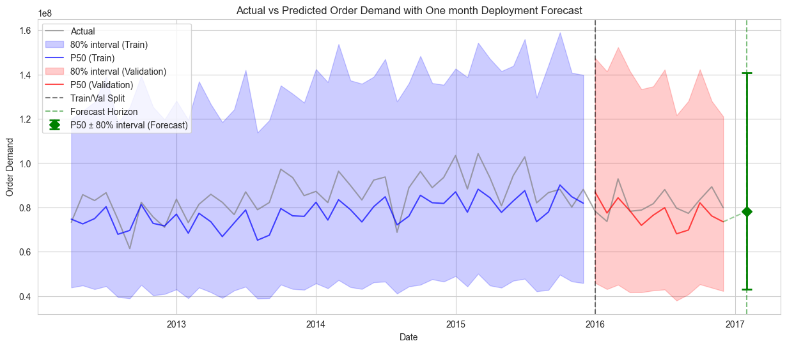

# Product Demand Forecasting: XGBoost Quantile Regression

## Table of Contents

1. [Overview](#overview)
2. [Pre-processing](#pre-processing)
3. [Modeling](#modeling)
4. [Generating Forecasts](#generating-forecasts)

## Overview

Monthly product-level demand forecasting with 80% prediction intervals at a t+2 month horizon. Given historical order data, the model predicts demand two months ahead for each product-warehouse combination, outputting three values: P10 (10th percentile), P50 (median), and P90 (90th percentile). P10 and P90 form the 80% prediction interval used for procurement decisions, while P50 serves as the point forecast.

**Data:** ~1M daily transaction rows across 2,160 products, 4 warehouses, and 33 product categories, spanning 2011-2017 ([Kaggle source](https://www.kaggle.com/datasets/felixzhao/productdemandforecasting)).

**Final validation performance:**

| Metric | Value |
|---|---|
| Pinball Loss (avg P10/P50/P90) | 3,880 |
| Scaled vs. Naive Baseline | P10: 0.285, P50: 0.807, P90: 0.503 |
| Per-Quantile Calibration | P10: 10.8%, P50: 51.4%, P90: 90.0% |
| WAPE (P50) | 35.4% |
| 80% Interval Coverage | 79.2% (target 80%) |
| Mean Winkler Score | 57,540 |
| Quantile Crossing | 14 rows (0.05%) |

## Pre-processing

### Data Cleaning

**Missing dates.** 11,239 rows (1.1%) had missing date values, confined to Whse_A and Category_019. These were dropped since they could not be placed in the time series.

**Parenthesized values.** Approximately 10,500 rows (1%) contained values like `(100)`, which is accounting notation for negatives (returns, cancellations). These were corrected to negative integers. After monthly aggregation, only 0.51% of product-months net negative.

**Duplicate transactions.** 113,064 rows (10.9%) are exact duplicates across all columns. These are retained because identical transactions on the same day are plausible in order-level data (e.g. two separate orders of the same size). Note, in a real-world scenario, knowledge of data collection, domain knowledge and consultation with others would affect this decision. They are aggregated into monthly totals in the next step.

### Aggregation and Date Trimming

Daily transactions are summed to monthly totals per product-warehouse combination. The date range is trimmed to 2012-01 through 2016-12: 2011 is excluded because most products had no data until late in the year, creating artificial ramp-up patterns. The final month (2017-01) is excluded because it is incomplete.

### Stationarity and Target Transformation

An Augmented Dickey-Fuller (ADF) test confirmed raw monthly demand is non-stationary (p > 0.05) while 2-period differenced demand is stationary (p < 0.05). The 2-period differencing aligns with the t+2 forecast horizon, meaning the model predicts the change in demand between now and two months from now.

Before differencing, an arcsinh transformation is applied: `demand_diff = arcsinh(demand(t)) - arcsinh(demand(t-2))`. arcsinh compresses scale similarly to log for large values but, unlike log, is defined for negative values and linear near zero. This normalizes gradient magnitudes across demand scales so the model does not optimize exclusively for high-volume products. The raw target variable (demand differences) has a standard deviation of ~105,000; after arcsinh, the standard deviation drops to ~1.7.

Demand is reconstructed at prediction time via `predicted_demand = sinh(arcsinh(lag_2) + predicted_diff)`.

### Interior Gap Reindexing

Monthly aggregation only produces rows for months with orders. Since `groupby().shift(2)` shifts by position rather than calendar months, gaps between observed months cause lag features to reference the wrong time period. Each product-warehouse is reindexed to a contiguous monthly grid within its first-to-last observed date range, with gaps filled as zero demand. This added 24,575 rows (18% increase), bringing zero-demand to 15.5%.

### Sparse Product Filtering

Product-warehouse combinations with a fill rate below 50% (nonzero months / total months) are excluded from training. Their lag features would be dominated by zero-filled gaps rather than real demand patterns. Even the real observations of sparse products have unreliable features because their lags mostly pull from filled zeros. This removed 239 combinations (8.4%), leaving 148,623 rows with 11.7% zero-demand. Excluded products can still be forecast at inference time via cross-product features (Product_Code, Product_Category, Month).

### Feature Encoding

**Product_Code** is encoded using sklearn's `TargetEncoder` (cv=5, smooth="auto"), which replaces each product code with a smoothed mean of its demand values, blended toward the global mean to prevent overfitting for low-frequency products. This is necessary because Product_Code has ~2,000 unique values, too many for XGBoost's native categorical handling.

**Warehouse, Product_Category, and Month** use XGBoost's native categorical support (`enable_categorical=True`), which learns optimal categorical splits directly rather than relying on ordinal or one-hot encoding.

### Train/Validation Split

Date-boundary split at 2016-01 (80/20). All products for a given month are in the same set, preventing partial-month artifacts when aggregating predictions by date. Training covers 2012-01 to 2015-12 (118,981 rows), validation covers 2016-01 to 2016-12 (29,642 rows).

## Modeling

### Why XGBoost

XGBoost handles this problem's heterogeneous feature set naturally: continuous lag/rolling features alongside target-encoded identifiers and native categorical variables, without requiring separate preprocessing pipelines. It also handles missing values natively, which is useful during inference when lag features may be unavailable for newer products.

Its tree-based architecture captures non-linear demand patterns and feature interactions that linear models would miss. Trees split the feature space into regions, each with its own prediction. This means the model can learn that Product A has high demand in December while Product B peaks in June, without explicit interaction features. A linear model with a Month feature learns a single coefficient for December that applies to all products equally. Capturing product-specific seasonality would require manually creating Month x Product_Code interaction terms (~24,000 columns for 2,000 products x 12 months). Trees discover these interactions automatically through successive splits.

The same applies to non-linear relationships: demand might increase with the rolling mean up to a point and then plateau. A tree captures this with a split threshold, while a linear model fits a single slope across the entire range.

The main limitation of tree-based models is that they can only make axis-aligned splits (one feature at a time). They cannot learn ratios between features or differences between features without multiple successive splits that approximate these relationships noisily. This is why `demand_ratio_2m` and `demand_momentum` are engineered explicitly rather than left for the model to discover.

### Why Quantile Regression

Standard regression predicts the mean, producing a single point forecast. Quantile regression predicts specific percentiles of the demand distribution, enabling prediction intervals that directly answer the business question: "What range should we plan for?" The P10-P90 interval gives procurement teams an 80% confidence range, while P50 provides the median forecast for expected-case planning.

Three independent XGBoost models are trained (P10 at α=0.10, P50 at α=0.50, P90 at α=0.90) using `objective='reg:quantileerror'`, which minimizes pinball loss. Each quantile has independently tuned hyperparameters via Bayesian optimization (`BayesSearchCV`, 50 iterations, 3-fold `TimeSeriesSplit`), with a dynamic pinball scorer that reads the target quantile from the estimator. This allows each quantile to find its own optimal tree depth, learning rate, and regularization.

### Feature Set

| Feature | Type | Description |
|---|---|---|
| Product_Code | Target-encoded | Product identity (~2,000 unique) |
| Warehouse | Native categorical | 4 warehouses |
| Product_Category | Native categorical | 33 categories |
| Month | Native categorical | Calendar month (1-12) |
| demand_lag_2m | Continuous | Demand 2 months ago |
| demand_lag_3m | Continuous | Demand 3 months ago |
| rolling_mean_3m | Continuous | 3-month rolling mean (shifted by 2) |
| rolling_std_3m | Continuous | 3-month rolling std (shifted by 2) |
| rolling_mean_12m | Continuous | 12-month rolling mean (shifted by 2) |
| rolling_std_12m | Continuous | 12-month rolling std (shifted by 2) |
| demand_ratio_2m | Continuous | demand_lag_2m / rolling_mean_12m (scale-independent) |
| demand_momentum | Continuous | demand_lag_2m - demand_lag_3m (recent direction) |

The ratio and momentum features are explicitly constructed because tree models cannot learn ratios or differences from axis-aligned splits. `demand_ratio_2m` became the single most important feature by XGBoost gain (63%): a lag value of 150 and a lag of 750,000 are incomparable in raw form, but when expressed as a ratio, both might equal 1.5 (50% above baseline), giving the model a signal that holds across demand scales.

All features are shifted by at least 2 months to ensure they are available at forecast time (t+2 horizon).

## Generating Forecasts

Once trained, the three quantile models are deployed through a single function that produces P10/P50/P90 forecasts and the associated 80% prediction interval for future months:

```python
forecasts = generate_forecasts(
    n_months=1,                      # Number of consecutive months to forecast
    forecast_from="2016-12",         # The "current" month. First forecast targets t+2 months
    history_df=monthly_df,           # Historical demand to build lag/rolling features from
    chain=False                      # Whether to feed predictions back as inputs (see below)
)
```

The function builds the lag, rolling, ratio, and momentum features from `history_df`, applies the fitted encoder, predicts the arcsinh-differenced target with each quantile model, and reconstructs demand via `sinh(arcsinh(lag_2) + predicted_diff)`. It returns a DataFrame with columns `[Product_Code, Warehouse, Forecast_Date, P10, P50, P90, Uncertainty]`, where `Uncertainty = P90 - P10` is the width of the 80% prediction interval. For each product-warehouse, P50 is the expected demand and the P10-P90 range is the planning interval.

### Single-step vs. Multi-step Forecasting

For a single month at the t+2 horizon, all required features come from real observed data. For horizons beyond t+2, the `chain` parameter controls how missing inputs are handled:

- **`chain=False` (history-only):** Lag features always come from real observations, so there is no error accumulation and each month's forecast is independent and reproducible. However, products whose lag window extends past the observed data are dropped, and months with no forecastable products are skipped with a warning. Best for short horizons and reproducibility.
- **`chain=True` (recursive):** Each month's P50 prediction is fed back as observed demand for subsequent months' features, so every product can be forecast at any horizon. The tradeoff is that prediction errors compound as the horizon grows, and rolling features increasingly reflect predicted rather than real demand. Best when long-horizon coverage matters more than precision.


*Validation predictions followed by a deployment forecast (green) at t+2 beyond the last observed month. The green point shows P50 with the 80% prediction interval as error bars.*
